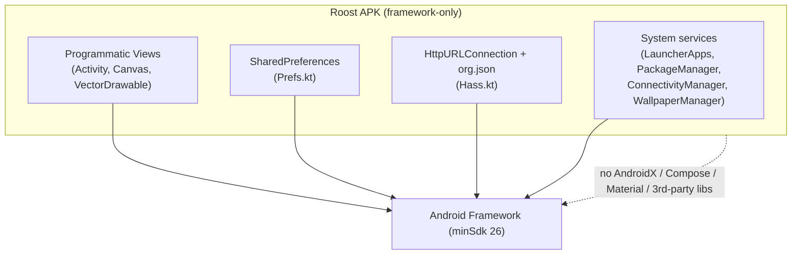

# ADR-0001: Framework-only, zero-dependency launcher

## Context and Problem Statement

Roost is a home-screen launcher that turns a spare phone into a dedicated device for an AI agent. It is meant to be small, auditable, and "a fun little repo" that anyone can read end to end. How much of the modern Android app stack (AndroidX, Jetpack Compose, Material Components, third-party libraries) should it depend on?

## Decision Drivers

* **Auditability / hackability** — a dedicated agent device runs privileged (it is the HOME app); the code should be small enough to read in one sitting.
* **Tiny artifact** — the APK should be trivially small and fast to build.
* **Longevity / low maintenance** — no dependency churn, no transitive-CVE surface, no build-tool version treadmill.
* **Public release** — vendor-neutral, MIT, contributor-friendly; fewer moving parts lowers the barrier.
* **The features we need are modest** — a grid of tiles, a few settings screens, a Canvas mascot, some SharedPreferences state, and (later) simple REST calls.

## Considered Options

* **A. Framework-only** — pure Android framework: `android.app.Activity`, programmatic `View`s, `Canvas`/`VectorDrawable`, system fonts, `SharedPreferences`, `HttpURLConnection`. No AndroidX, Compose, Material, or third-party libraries.
* **B. AndroidX + Material + Compose** — the conventional modern stack (RecyclerView/Compose, Material theming, Retrofit/OkHttp for networking, a Home Assistant client library, etc.).
* **C. Minimal AndroidX** — framework UI but pull in select libraries where they clearly help (e.g. an HTTP client, a JSON library).

## Decision Outcome

Chosen option: **A. Framework-only**, because the feature set is modest enough that the framework covers it, and the benefits (tiny APK, zero dependency churn, fully auditable) directly serve Roost's purpose as a privileged, dedicated-device launcher. This is the foundational constraint that governs downstream decisions — e.g. Home Assistant is spoken to via `HttpURLConnection` + `org.json` rather than a client library (see [ADR-0002](ADR-0002-pluggable-action-button-providers.md)).

### Consequences

* Good, because the APK is ~800 KB and builds in seconds with no dependency resolution surprises.
* Good, because the whole codebase is readable end to end; the "light hack" ethos holds.
* Good, because there is no jetifier/AndroidX/Compose version matrix to maintain against new AGP/Gradle releases.
* Bad, because we re-implement small conveniences (tile grids, list rows, a tiny REST client) that a library would provide.
* Bad, because framework widgets are more verbose and occasionally quirky (e.g. `GridLayout` weight sizing bit us; switches use the system accent unless explicitly tinted).
* Neutral, because if a future feature genuinely needs a heavy capability (e.g. an always-on wake-word engine), it is introduced as an **explicitly-flagged optional module**, not a default dependency.

### Confirmation

`app/build.gradle.kts` has an **empty `dependencies { }` block** and `android.useAndroidX=false`. Any PR that adds a `dependencies` entry or flips `useAndroidX` must either update or supersede this ADR. Reviewers check that new code uses framework primitives (programmatic views, `Canvas`, `VectorDrawable`, system fonts, `HttpURLConnection`, `org.json`).

## Pros and Cons of the Options

### A. Framework-only

* Good, because smallest possible APK and build.
* Good, because fully auditable — critical for the HOME app on a dedicated device.
* Good, because immune to dependency churn / transitive CVEs.
* Neutral, because the feature set is small enough to not miss libraries much.
* Bad, because more boilerplate and a few framework quirks to work around.

### B. AndroidX + Material + Compose

* Good, because faster to build rich UI; declarative Compose is pleasant.
* Good, because batteries-included networking/JSON/Home-Assistant clients.
* Bad, because large APK, heavy build, constant version-matrix maintenance.
* Bad, because it undermines the "small, auditable, hackable" identity of the project.

### C. Minimal AndroidX

* Good, because a middle ground — framework UI, a couple of well-chosen libraries.
* Bad, because "just one library" tends to pull transitive dependencies and reopens the version-matrix problem.
* Bad, because the line of "which libraries are OK" is subjective and erodes over time.

## Architecture Diagram

## More Information

* Enforced by `app/build.gradle.kts` (empty `dependencies`, `android.useAndroidX=false`).
* Downstream: [ADR-0002](ADR-0002-pluggable-action-button-providers.md) applies this constraint to the Home Assistant client (HttpURLConnection, not a library).
* Related quirks encountered (documented in git history): `GridLayout` weight collapse; `Switch`/`RadioButton` needing explicit accent `ColorStateList`; Docusaurus/webpack pins for the docs site (separate project, not the app).
