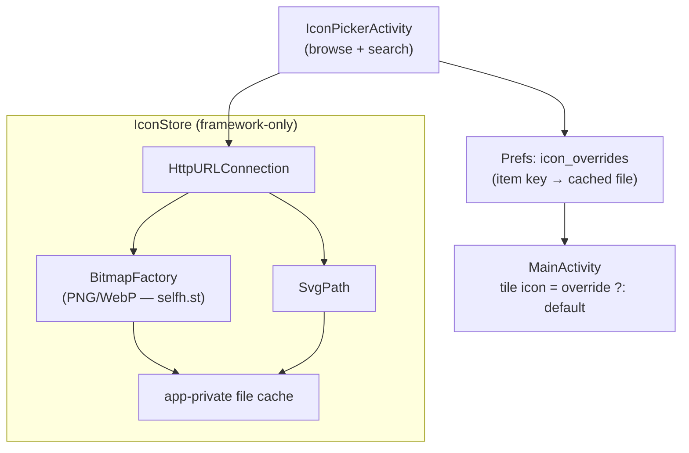

# ADR-0003: Icon rendering strategy for the remote icon picker

## Context and Problem Statement

The remote icon picker (Gitea issue #3) lets users override a tile's icon from three collections: **selfh.st** (self-hosted-app icons; PNG/WebP + SVG), **Simple Icons** (brand icons; SVG only), and **Iconify/Heroicons** (SVG only). Android's framework has **no runtime SVG renderer** — `VectorDrawable` is compile-time XML, not runtime SVG. [ADR-0001](ADR-0001-framework-only-zero-dependency-launcher.md) forbids third-party libraries. How do we render icons fetched at runtime from these sources without adding a dependency?

## Decision Drivers

* **ADR-0001**: no SVG/image library; framework primitives only.
* Two of three sources are **SVG-only**; one offers **raster** (selfh.st PNG/WebP).
* Icon sets are **monochrome, path-based** (Simple Icons = a single `<path>`; Heroicons = a few paths) — not full SVG (no gradients/filters needed).
* Fetched icons must be **cached** locally and rendered as a normal `Drawable`.

## Considered Options

* **A. Raster-first + a minimal in-house SVG-path renderer.** Decode PNG/WebP with `BitmapFactory` (selfh.st). For SVG sources, fetch the SVG text, extract `<path d="…">` data, parse it into an `android.graphics.Path`, and render to a tinted `Bitmap` on a `Canvas`. No library.
* **B. Bundle an SVG library** (e.g. AndroidSVG / Coil-SVG). Would require amending or superseding ADR-0001.
* **C. Remote rasterization proxy** — route SVG sources through a service that returns PNG (e.g. an Iconify raster endpoint or a self-hosted proxy), then `BitmapFactory`.

## Decision Outcome

Chosen option: **A. Raster-first + a minimal in-house SVG-path renderer.** It keeps the zero-dependency rule ([ADR-0001](ADR-0001-framework-only-zero-dependency-launcher.md)) while covering all three sources: `BitmapFactory` for selfh.st raster, and a small `SvgPath` parser (`<path d>` → `android.graphics.Path`) for the SVG sets, which are monochrome and path-based. Because the parser is *our own small code*, not an imported library, it satisfies the constraint. Delivery is incremental: the **raster path (selfh.st) ships first** (framework-trivial, high value for self-hosted-dashboard devices), and the SVG-path renderer follows.

### Consequences

* Good, because zero new dependencies; all three sources reachable.
* Good, because selfh.st (the most relevant source for this device class) works immediately via `BitmapFactory`.
* Bad, because the SVG-path parser must cover the common path grammar (M/L/H/V/C/S/Q/T/A/Z, absolute + relative); elliptical arcs (`A`) are the fiddly part.
* Bad, because non-path SVG features (gradients, multiple fills, `<use>`, CSS) are unsupported — acceptable for monochrome icon sets, but some icons may render imperfectly.
* Neutral, because rendered icons are cached to app-private storage and treated as ordinary `Drawable`s thereafter.

### Confirmation

`IconStore` (fetch + cache), `SvgPath` (path parser), and the raster path via `BitmapFactory` — all framework-only. `app/build.gradle.kts` `dependencies {}` stays empty. Overrides persist in `Prefs` (item key → cached file). A reviewer confirms no image/SVG library was added.

## Pros and Cons of the Options

### A. Raster-first + in-house SVG-path renderer

* Good, because keeps ADR-0001 intact and covers all sources.
* Good, because incremental — raster ships first.
* Bad, because a hand-rolled SVG-path parser (esp. arcs) is non-trivial and won't cover exotic SVGs.

### B. Bundle an SVG library

* Good, because robust, complete SVG support with little code.
* Bad, because it breaks ADR-0001 (the whole "auditable, tiny, no-deps" identity) for a cosmetic feature.

### C. Remote rasterization proxy

* Good, because trivial on-device (always `BitmapFactory`).
* Bad, because it introduces an external/hosted dependency and a privacy hop for every icon; brittle if the proxy changes.

## Architecture Diagram

## More Information

* Implements the "Change icon" action of Gitea issue #2 and issue #3.
* Extends [ADR-0001](ADR-0001-framework-only-zero-dependency-launcher.md); related to [ADR-0002](ADR-0002-pluggable-action-button-providers.md) (tiles/actions carry the keys that overrides attach to).
* Sources: selfh.st `https://cdn.jsdelivr.net/gh/selfhst/icons/`, index via `https://data.jsdelivr.com/v1/packages/gh/selfhst/icons`; Simple Icons `https://cdn.simpleicons.org/<slug>`; Iconify `https://api.iconify.design/<set>/<name>.svg`.
