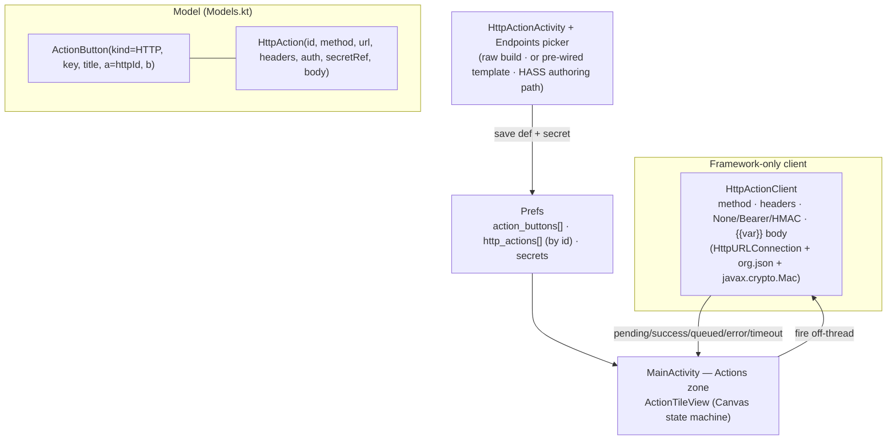

# ADR-0004: Generalized HTTP-action provider with on-tile firing feedback

## Context and Problem Statement

[ADR-0002](ADR-0002-pluggable-action-button-providers.md) established a pluggable
`ActionButton(kind, key, title, a, b)` model, and the first non-shortcut provider — Home Assistant
scenes — is just *"POST some JSON to a URL with a bearer token."* Nearly every service in the owner's
stack (Switchboard's durable task queue, LiteLLM, Gitea webhooks, msgbrowse, generic Home Assistant
services, any self-hosted dashboard) is the same shape: **an HTTP request with a method, URL, headers,
an auth scheme, and a JSON body.** Writing a bespoke provider per service (as `HASS_SCENE` is today)
does not scale.

Two problems follow: (1) we need **one general HTTP-action primitive** that subsumes the HASS-specific
provider and lets the owner wire up any endpoint from the phone; and (2) an HTTP request is
**asynchronous and can fail**, so the current feedback — a `Toast` popped from `invokeAction()` — is
wrong: it is off-tile, it vanishes, it cannot show "in flight," and it is illegible from across a room.
The firing outcome must live **on the control itself**.

## Decision Drivers

* **One primitive, not N providers** — any endpoint becomes a saved instance; new integrations are data,
  not code.
* **On-tile legibility** — `idle → pending → success/queued → error → timeout` must read on the tile,
  from across a dim room, with a **fixed semantic color ramp** (not the themeable accent) so "failed"
  stays red even when the accent is red-ish.
* **Framework-only** (per [ADR-0001](ADR-0001-framework-only-zero-dependency-launcher.md)) — programmatic
  views, `HttpURLConnection` + `org.json`, `Canvas` + `Handler` animation, `SharedPreferences`. No
  library.
* **ADR-0002 compatibility** — this is a *new provider kind*, not a new model; it must slot into the
  existing `ActionKind`/`invoke`/`icon` dispatch with no change to persistence shape or the home render
  loop's contract.
* **Migration, not breakage** — existing `HASS_SCENE` buttons must keep working; the HASS account + scene
  picker survives as a convenience *authoring path* that produces an HTTP action.
* **Secrets never visible** — tokens/HMAC secrets are entered masked, stored in prefs, shown only as
  `•••• last4`, and redacted from every echo (test-fire, error detail).

## Considered Options

* **A. Generalized HTTP provider + on-tile state machine.** Add `ActionKind.HTTP`. An HTTP action is a
  richer definition (method, URL, headers, auth, JSON-body template with `{{var}}` substitution) stored
  in its **own prefs collection keyed by id** (mirroring `hass_accounts`), with the `ActionButton`
  holding a reference (`a = httpActionId`). Firing runs off-thread and drives an animated `Canvas`
  status disc through the state machine. HASS scenes become one saved HTTP action; the HASS picker
  pre-fills a builder.
* **B. Keep bespoke providers, add HTTP as just one more.** A third hand-rolled provider alongside
  `SHORTCUT` and `HASS_SCENE`, with the two thin `a`/`b` args and the current Toast feedback.
* **C. Raw-intent/URL buttons.** A single generic button where the user pastes a URL; no builder, no
  auth, no body templating, no on-tile feedback.

## Decision Outcome

Chosen option: **A**. It makes every current and future "does a thing" control one instance of a single
primitive, confines the network mechanics to one client, and puts the firing story where it belongs — on
the tile. The two opaque `a`/`b` args of the `ActionButton` are too thin for a full request, so — exactly
as `HASS_SCENE` keys `a = HassAccount.id` — an HTTP button sets `a = httpActionId` and the full
definition lives in a dedicated tolerant JSON collection in `Prefs`. This preserves the ADR-0002
invariant that a new provider touches only the kind enum, its provider object/definitions, the
`icon`/`invoke` dispatch, and one authoring surface — **not** the persistence contract or the home render
loop's shape.

### Consequences

* Good, because integrations become configuration: the owner wires any endpoint from the phone with no
  new code.
* Good, because the async outcome is legible on the control (pending/success/queued/error/timeout) with a
  fixed semantic ramp, replacing the illegible off-tile Toast.
* Good, because HASS is no longer special — one client, one render path; the scene picker is demoted to an
  authoring convenience.
* Bad, because **HMAC body signing** reaches past plain `HttpURLConnection` to `javax.crypto.Mac`
  (`HmacSHA256`). This ships in the Android platform (no dependency), so it stays within
  [ADR-0001](ADR-0001-framework-only-zero-dependency-launcher.md), but it is the one primitive beyond the
  HTTP/JSON baseline and is called out explicitly.
* Bad, because on-tile animation adds a `Canvas` view driven by a `Handler(16ms)` `invalidate()` loop that
  MUST pause when the Activity is not resumed (battery), an extra lifecycle obligation.
* Neutral, because the HASS-specific `ActionKind.HASS_SCENE` is retained for backward compatibility and
  as the picker's authoring output; it MAY be collapsed into `HTTP` in a later cleanup.

### Confirmation

`ActionKind.HTTP` in `Models.kt`; an `HttpAction` definition type + a general `HttpActionClient`
(method, arbitrary headers, `None`/`Bearer`/`HMAC` auth, `{{var}}` body substitution) generalizing
`Hass`; definitions persisted via a tolerant JSON collection in `Prefs` keyed by id; a new
`HttpActionActivity` builder + a "Pick from my endpoints" picker; an animated `Canvas` status-disc view
for the firing state machine; `invokeAction()` dispatching `HTTP` to the async fire + on-tile feedback
instead of a Toast. A reviewer confirms a saved HASS scene renders and fires identically as an HTTP
action and that no secret appears in any label, echo, or error detail. Formalized in
[SPEC-0002](../openspec/http-actions/spec.md).

## Architecture Diagram

## More Information

* Formalized in [SPEC-0002](../openspec/http-actions/spec.md); extends [SPEC-0001](../openspec/action-buttons/spec.md).
* Realizes design brief `docs/design-briefs/a-http-action-tile.md`.
* The fixed semantic ramp — success/queued **Sage `#93B98C`**, timeout **Amber `#D98F3C`**, error
  **Clay `#CF6B5A`** — is shared with the presence/status work and MUST NOT follow the themeable accent.
* Retained limitation from [ADR-0002](ADR-0002-pluggable-action-button-providers.md): the `icon`/`invoke`
  `when(kind)` dispatch sites must be kept in sync; `HTTP` adds one branch to each.
