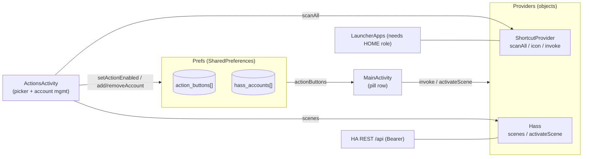
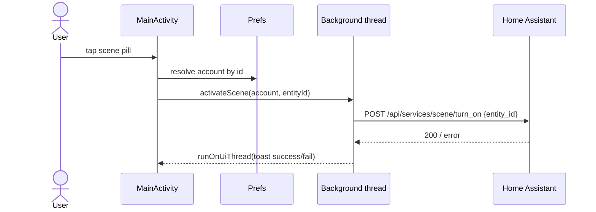

# Design: Action Buttons

## Context

Roost is a framework-only Android launcher ([ADR-0001](../../adrs/ADR-0001-framework-only-zero-dependency-launcher.md)). Its home screen already renders app tiles (things you *open*) and web-app tiles. Action buttons add things you *do*: an icon + short title that performs one action on tap. The set of sources is open-ended (app-shortcuts, Home Assistant scenes, and later scripts/webhooks/Tasker/MQTT), so the design centers on a pluggable provider model per [ADR-0002](../../adrs/ADR-0002-pluggable-action-button-providers.md). This spec is realized in `Models.kt`, `ShortcutProvider.kt`, `Hass.kt`, `ActionsActivity.kt`, `Prefs.kt`, and the home render in `MainActivity.kt`.

## Goals / Non-Goals

### Goals
- One uniform button model; render + persistence generic over provider.
- Adding a provider is small and localized (enum value + provider object + two dispatch branches + one picker section).
- Framework-only: no HTTP/JSON/Home-Assistant libraries.
- Discoverable configuration: scan/list candidates with real labels and icons, then tick to enable.
- Multiple Home Assistant instances.

### Non-Goals
- Two-way state (Roost does not display live scene/entity state; buttons are fire-and-forget).
- Home Assistant beyond scenes in v1 (scripts, automations, services, webhooks are future providers).
- A compile-time-enforced provider registry (dispatch is `when(kind)`; revisit if providers proliferate).
- OAuth / HA cloud auth flows — a user-pasted long-lived access token is the auth model.

## Decisions

### Uniform button value type with two opaque args

**Choice**: `ActionButton(kind: ActionKind, key: String, title: String, a: String, b: String)`. Per provider: SHORTCUT → `a=package, b=shortcutId`; HASS_SCENE → `a=accountId, b=entityId`.
**Rationale**: Keeps persistence and rendering provider-agnostic; the `key` (`kind:a:b`) gives stable identity for toggling and de-duplication.
**Alternatives considered**:
- Typed per-provider payload (sealed class): more self-documenting, but adds ceremony and a serialization branch per provider; the opaque-args form is cheaper and providers own their (de)construction.
- A single generic "raw intent/URL" button: no discovery, hostile UX (rejected in ADR-0002).

### Providers are stateless Kotlin objects

**Choice**: `ShortcutProvider` and `Hass` are `object`s exposing scan + invoke (+ icon for shortcuts). No provider instances, no registry.
**Rationale**: Providers hold no state; account/enabled state lives in `Prefs`. Objects are the smallest unit that matches "localized provider knowledge."

### Home Assistant via HttpURLConnection + org.json

**Choice**: A ~40-line `Hass` object using `HttpURLConnection` and `org.json`, scenes only: `GET /api/states` (filter `scene.*`) and `POST /api/services/scene/turn_on`.
**Rationale**: Direct consequence of [ADR-0001](../../adrs/ADR-0001-framework-only-zero-dependency-launcher.md) — no client library. The HA REST API is simple (Bearer token, JSON), so a hand-rolled client is small and sufficient.
**Alternatives considered**: A Kotlin HA client library or Retrofit/OkHttp — rejected: violates the zero-dependency constraint for a trivial amount of code.

### Persistence as flat JSON in SharedPreferences

**Choice**: `action_buttons` and `hass_accounts` are each a JSON array string in `SharedPreferences`; loaders skip malformed/unknown entries.
**Rationale**: Matches the existing `Prefs` pattern (web apps, favorites); no database, no migrations; tolerant parsing avoids "one bad entry breaks everything."

### Threading: `Thread {} + runOnUiThread`

**Choice**: Background network on a plain `Thread`; results marshaled back with `runOnUiThread`; scans (shortcuts, scenes) run in the background and populate their container on completion.
**Rationale**: Fire-and-forget taps and occasional scans don't warrant an executor framework; framework primitives suffice and keep the dependency count at zero.

## Architecture

Scene activation flow:

## Risks / Trade-offs

- **Home Assistant long-lived token at rest** → stored in the app's private `SharedPreferences` (app-sandboxed). Acceptable for a single-owner dedicated device; the token is the user's own and never leaves the device except as a Bearer header to the user's own instance. Documented; not additionally encrypted in v1.
- **`when(kind)` dispatch can drift** (a new kind forgotten in `icon`/`invoke`) → mitigated by keeping the two sites adjacent and small; escalate to a sealed hierarchy if providers grow.
- **App-shortcut access requires the HOME role** → scanner returns empty and taps fail gracefully when Roost isn't the default launcher; no crash.
- **Some agent apps publish no shortcuts** (e.g. the Claude app today) → the provider simply surfaces nothing for them; not an error. Users lean on Home Assistant / future providers.
- **Fire-and-forget with no live state** → a scene tap gives success/failure feedback but the pill does not reflect ongoing state; acceptable for v1, revisit if two-way state is wanted.
- **Self-signed / LAN-only HA instances** → `HttpURLConnection` will reject untrusted TLS; users on LAN-only HTTP or self-signed certs may need a valid cert or a reverse proxy. Noted as an open question.

## Migration Plan

Greenfield feature; no migration. Ships additively behind new `Prefs` keys (`action_buttons`, `hass_accounts`) that default to empty.

## Open Questions

- Should scene buttons show live/last-activated state (two-way), or stay fire-and-forget?
- How to handle LAN-only HA over self-signed TLS without weakening the client's trust store?
- Beyond scenes: add HA scripts, `service.call`, and generic HTTP webhooks as additional providers — same model, new kinds.
- Should the shortcut scan be incremental/cached rather than a full sweep each time, if devices with many apps make it slow?
